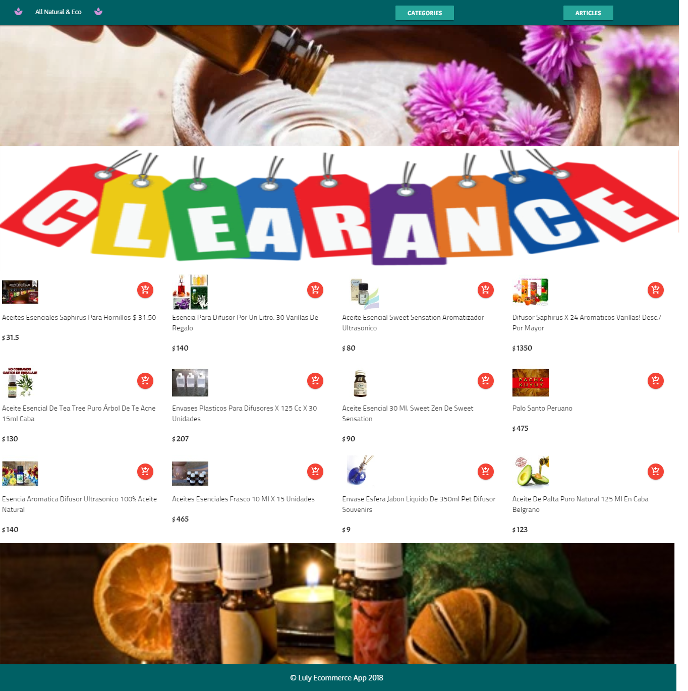
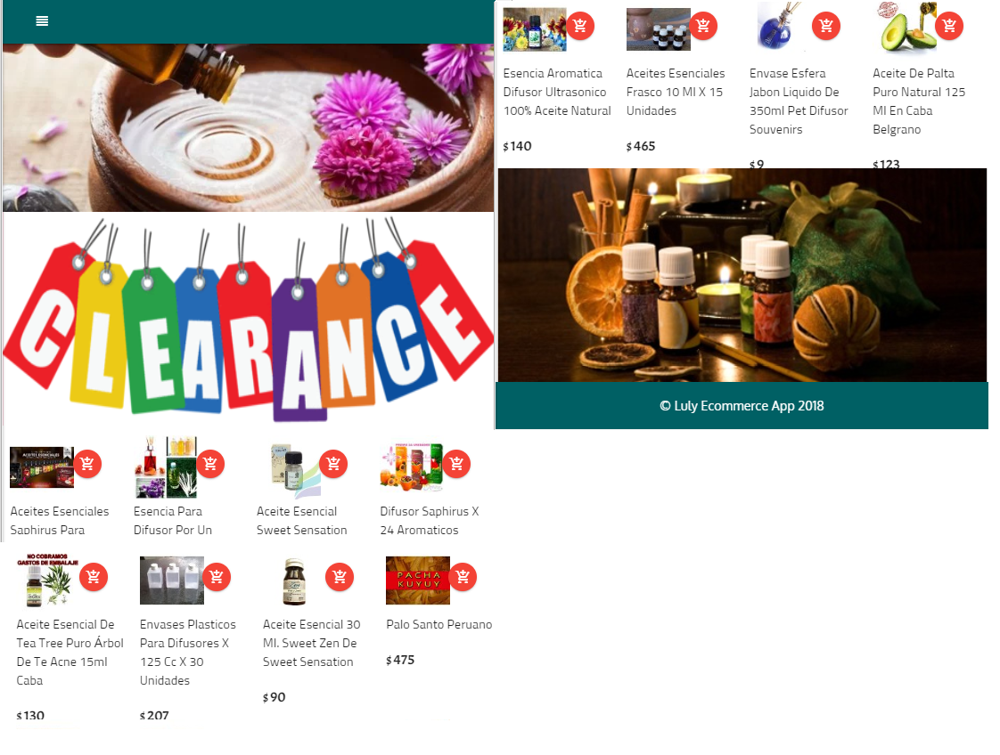

# All Natural & Eco (Ecommerce)

Este repositorio contiene el ejercicio para hacer una página Ecommerce utilizando React.

---
## Descripción

All Natural & Eco es una aplicación tipo ecommerce con formato SAP (single page aplication). 

#### Se utilizó:
* React
* Materialize React (Diseño responsivo: mobile y desktop)
* Firebase ( Auth, Database y Storage )
* CSS3
* HTML5
* API de Mercado Libre

---

### Vista Desktop:

### Vista Mobile:

---
## Autora

**Lourdes Atilano**

---
## Desarrollado para 
[Laboratoria](https://laboratoria.la)
